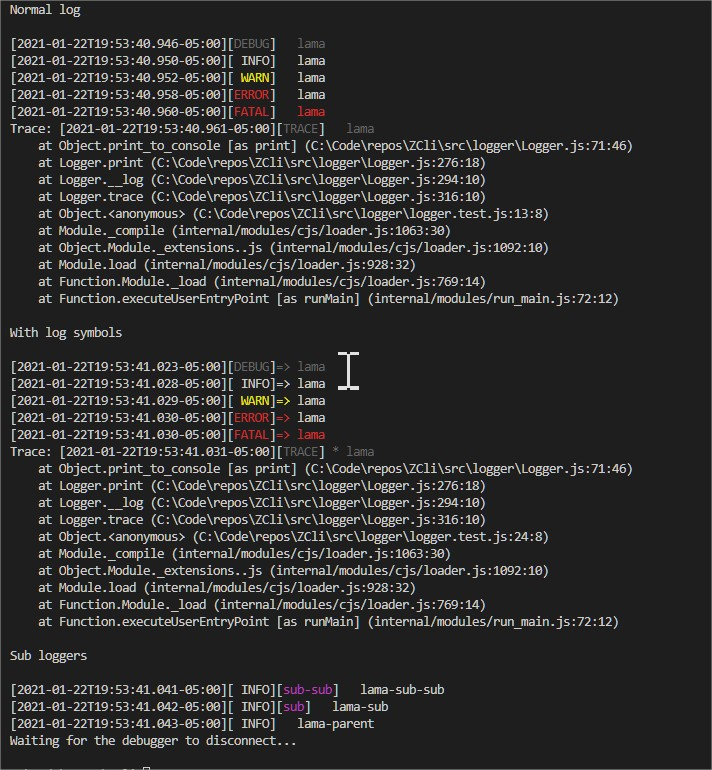

# A CLI tool with file configuration

This engine allows for the efficient, object centric auto generated
command line interface, which allows one to save and load
the configuration from a file.

## BETA

## Example



## TL;DR

To define a simple cli,

```javascript
new (require('./index').Cli)({name: 'my_cli'})
  .default(
    async ({arg = null, flag = false}) => {
      console.info('Recived argument: ' + arg)
      console.info('Flag is: ' + flag)
    },
    {
      arg: {
        type: 'named',
        aliases: ['a'],
      },
      flag: {
        type: 'flag',
      },
    }
  )
  .showHelp()
  .parse(['-a', 'The argument'])
  .catch((err) => {
    console.error(err)
    process.exit(1)
  })
```

With inner commands,

```javascript
const Cli = require('@lamaani/zcli').Cli
const cli = new Cli({name: 'myapp'})
const myrunner = new MyRunner()

// optional sub menu:
cli.set('run', {}, {description: 'stuff to run'})

// Using a class to define the arguments.
// the command: myapp run class
cli.set('run class', myrunner, {
  description: 'Get options from a class',
  action: (options) => myrunner.run(options),
})

// Directly define the arguments.
cli.set(
  'run special',
  {
    arg: {
      type: 'named',
      aliases: ['a'],
    },
    flag: {
      type: 'flag',
    },
  },
  {
    description: 'run an anonymous action.',
    action: (options) => console.log(JSON.stringify(options, null, 2)),
  }
)

cli
  .parse()
  .then((rslt) => {
    if (typeof rslt == 'number' && rslt > 0) process.exit(rslt)
  })
  .catch((err) => {
    console.error(err)
    process.exit(1)
  })
```

Where MyRunner is,

```javascript
/** @typedef {import('ZCli').CliArgument} CliArgument */

class MyRunner {
  constructor() {
    // arguments that start with __$
    // are cli arguments, and will
    // be set to this object when parsed.

    /** @type {CliArgument} */
    this.__$arg = {
      type: 'named',
      description: 'Some cli argument',
      aliases: ['a'],
      parse: (val) => val,
      default: 'will be set to arg',
    }
    /** Will be set to this value */
    this.arg = null
  }

  run(options) {}
}
```

To list options,

```shell
my_app --help
```

## Commands

In `ZCli`, all commands are constructed as sentences, an example for a simple command would be,

```
myapp run special case positional_1 --flag --arg val positional_2
```

This above command would be translated to,

```javascript
command_name='myapp run special case'
command_options={
  positional: ['positional_1','positional_2']
  named: {
    flag: true,
    arg: 'val'
  }
}
```

Named arguments or flags are not position dependent, therefore, the
following is equivalent to the above,

```
myapp --flag run special --arg val case positional_1 positional_2
```

### Limitations

1. There are no combined flags, i.e. no `-wWyDt`.
1. Arguments are parsed only as,
   - Single letters: `a` -> `-a`
   - Multi letters: `arg` -> `--arg`
1. Positional arguments are only allowed for the final command, otherwise all positional arguments are parsed as commands.

### Arguments

#### Argument types:

1. `named` - a regular named argument. Any value. `--arg, -a`
2. `flag` - A named argument, but no value (true if exists, in config you must set the value). `--flag, -f`
3. `positional` - An argument that follows the command. Will be added to an array.
4. `env` - An argument that would not appear in the CLI, but rather is only loaded from the
   environment variable. (Can be assigned in config)
5. `overflow` - Catch all for any argument after the positional arguments. Allows
   unknown number of input arguments.
6. `transfer` - Catch any argument after the symbol `--`. This allows separation of command arguments
   from arguments that need transferring to another command.

| Name                | description                                                                                                                                | possible values                                                  | default                                                             |
| ------------------- | ------------------------------------------------------------------------------------------------------------------------------------------ | ---------------------------------------------------------------- | ------------------------------------------------------------------- |
| type                | The argument type                                                                                                                          | `['named', 'flag', 'positional', 'env', 'overflow', 'transfer']` | named                                                               |
| field_name          | The name of the field to update on the parent object                                                                                       | [any]                                                            | The field name in the object                                        |
| match               | The name of the argument to match if `named` or `flag`                                                                                     | [any]                                                            | the field name, where any non letter or number is replaced with `-` |
| default             | the default value.                                                                                                                         | [any]                                                            | [null]                                                              |
| enviromentVariable  | The matching environment variable. If exits, will be taken instead of default. The env in nodejs will be updated to match the field value. | [string]                                                         | If `env` then the field_name, otherwise null                        |
| aliases             | Array, the possible command aliases                                                                                                        | string[]                                                         | []                                                                  |
| description         | The argument description.                                                                                                                  | [string]                                                         | null                                                                |
| parse               | Method: `(val)=>[any]`. Called before any assignment.                                                                                      | [function]                                                       | null                                                                |
| doNotAssignToParent | If true, dose not assign the argument to its parent.                                                                                       | `true`/`false`                                                   | `false`                                                             |
| doNotAssignToEnv    | If true, dose not assign the argument to the environment variable.                                                                         | `true`/`false`                                                   | `false`                                                             |
| canBeStored         | If true, allows this argument to be stored to disk (will appear in the configuration file)                                                 | `true`/`false`                                                   | `true`                                                              |

## File configuration manager

To add a file configuration manager,

```javascript
const cli = new (require('ZCli').Cli)()
const fs = require('fs')
const CliConfigCommand = require('zlib-cli/CliConfigCommand')

new CliConfigCommand(
  Cli,
  // command to load the configuration as a javascript object.
  () => require('./my_config.json'),
  // command to save the configuration to file.
  (config) => {
    fs.writeFileSync('./my_config.json', JSON.stringify(config))
  }
)
```

Then,

```shell
# to list
myapp config list
# myapp config get [command with dots] [named/flag]
myapp config get run.special.case arg
$> 48
# myapp config set [command with dots] [named/flag] [val/empty to remove]
myapp config set run.special.case arg 42
```

# Contribution

Are welcome, please post issues or PR's if needed.

# Implementations still missing:

Add an issue (or better submit PR) if you need these.

1. XCom
1. Examples (other than TL;DR)

# Licence

Copyright ©
`Zav Shotan` and other [contributors](https://github.com/LamaAni/ZCli/graphs/contributors).
It is free software, released under the MIT licence, and may be redistributed under the terms specified in `LICENSE`.
